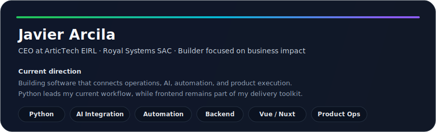
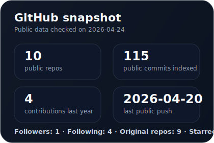
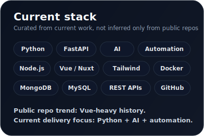

# 
Javier Arcila

CEO at <b>ArticTech EIRL</b> · Software builder at <b>Royal Systems SAC</b> 
Python · AI integration · Automation · Backend · Vue/Nuxt frontend

 

<a href="https://www.linkedin.com/in/javier-arcila">LinkedIn</a> ·
<a href="https://artic-tech.vercel.app/">ArticTech</a> ·
<a href="mailto:javierarcilab@gmail.com">Email</a>

---

  

 

  
  

---

## About

I build business-oriented software with a strong focus on **Python**, **AI-assisted processes**, **automation**, **backend systems**, and **digital products**.

I also keep a solid frontend side when the product needs it, especially with **Vue**, **Nuxt**, and modern UI stacks.

---

## Focus

- AI integration for real workflows
- Automation and internal tools
- Python-first backend development
- APIs, integrations, and operational systems
- Frontend delivery with Vue/Nuxt when needed

---

Custom widgets generated from public GitHub data queried on 2026-04-24.
